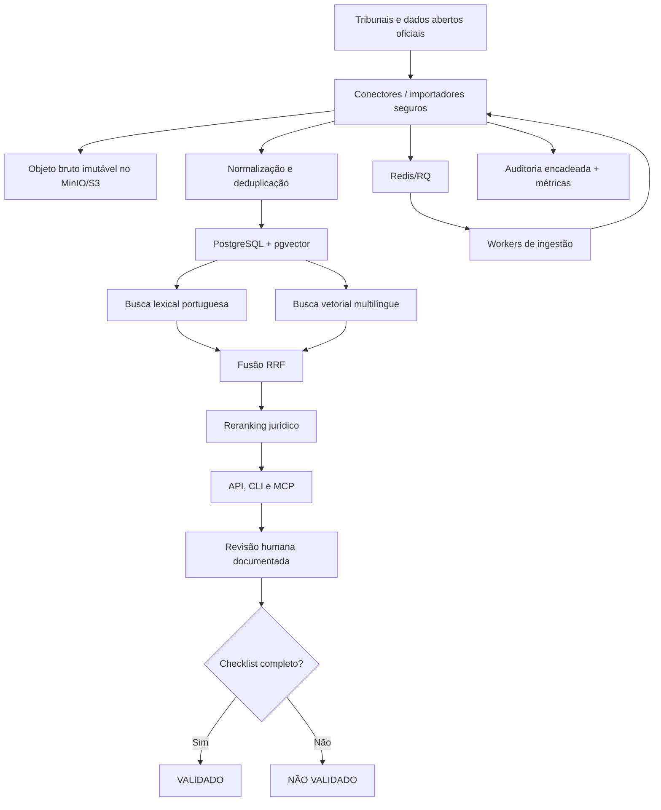

# Arquitetura

## Camadas

- **Domínio:** documentos, proveniência, estados de evidência, chunks e rotas judiciais.
- **Persistência:** SQLite/arquivos localmente; PostgreSQL/pgvector e MinIO/S3 em produção.
- **Recuperação:** texto integral com configuração portuguesa, embeddings de 768 dimensões e RRF.
- **Ranking jurídico:** força, vinculação, atualidade, tribunal superior e tribunal da UF.
- **Ingestão:** conteúdo remoto oficial, lotes JSON/JSONL/CSV/ZIP e deduplicação canônica.
- **Operação:** FastAPI, Redis/RQ, workers, métricas e health checks.
- **Interfaces:** CLI, MCP, Codex, Claude, Cowork e Custom GPT.

## Limites de confiança

O código automatiza integridade, proveniência, busca e persistência. Não determina sozinho a ratio decidendi, o fundamento vencedor, a aderência fática ou a vigência. O estado `CONFIRMADO` é o teto automático; `VALIDADO` exige seis checagens jurídicas e revisor identificado.

## Self-healing seguro

Retentativas cobrem somente falhas transitórias. Circuitos abrem após falhas consecutivas ou controles de acesso. Mudanças de URL são resolvidas a partir do hub oficial e precisam de revisão antes de alterar o registro. TLS, CAPTCHA, `401`, `403` e `429` nunca são contornados.
